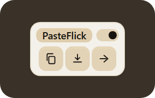
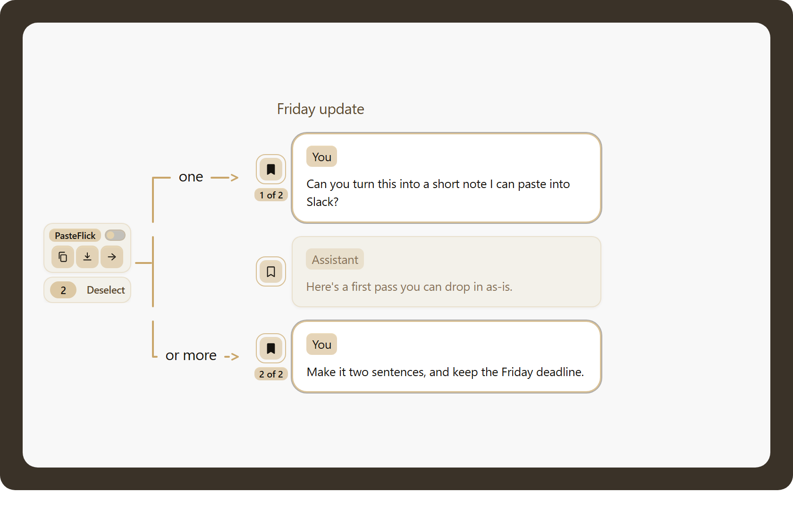
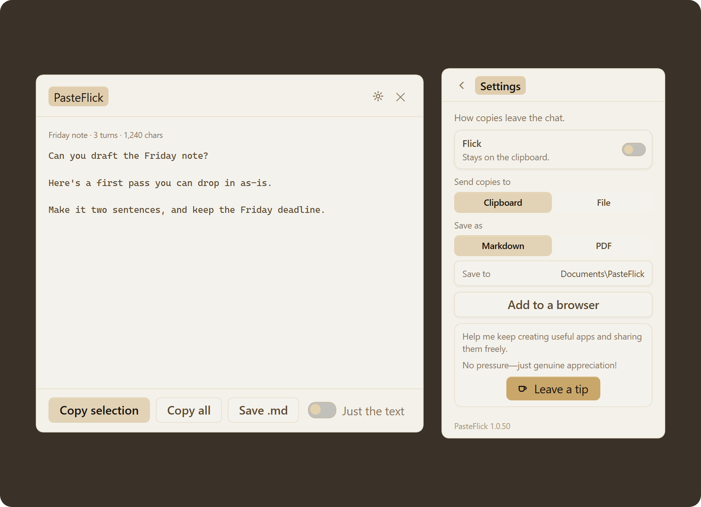

# PasteFlick

PasteFlick is a Windows browser extension for ChatGPT. Long chats fight the clipboard. Copy a highlight or the visible thread, then Flick it into the last app you were using: Word, Notes, Cursor, wherever you just were.

It copies what is already on the page, not turns ChatGPT has not rendered. One chip on the chat: Copy, Save, or Flick. Bookmark messages with pins. Save as Markdown or PDF. Copy and Save can be just the text, or with notes. Flick still sends what you see. Code and tables come along.

Works in Brave, Chrome, Edge, Chromium, and Arc. ChatGPT only. Not affiliated with OpenAI.

  

  

## What you get

One chip under the chat title. Highlight a passage, or take the visible thread, then Copy, Save, or Flick. ChatGPT’s own buttons stay where they are.

Bookmark a message, or a few. Each pin shows 1 of 3. Deselect slides out under the chip with the count, so you can clear the set in one tap.

A code block has its own small card. Flick is the main button, so you can send that snippet without bookmarking the message first.

**The toolbar icon.** On a chat it opens the thread as a document. Highlight, copy, or save as Markdown. Settings is the gear. The chip is still the fast path while you read.

**Where it goes.** Pick one in Settings.

- **Clipboard.** Ready to paste when you are.
- **Flick.** Into the last app you were in.
- **File.** Markdown or PDF, in a folder you pick.

The first time you copy, allow clipboard access if ChatGPT or the browser asks.

## Keep a copy

Keep the visible thread, a highlight, or the messages you bookmarked. A file you can open later, or the words in the last app.

- **Markdown.** For Cursor, notes, and anything that reads .md.
- **PDF.** A copy you can send or print.
- **Text.** Just the words, or with notes. Flick still sends what you see.

Code and tables come along in the transcript.

  

## Install

Download the [Windows zip](https://github.com/HeadAroundIt/pasteflick/releases/latest), extract it, and run `Install PasteFlick.bat`.

Copy to the clipboard works on its own. Flick and PDF save use a small Windows helper that Setup installs and starts with Windows. You do not install Python.

**Finish in the browser.** Browsers will not silently install extensions. Setup opens a short guide, copies the folder path, and launches your Extensions page.

1. Turn on Developer mode
2. Click Load unpacked
3. Paste the path and open that folder

Leave Developer mode on. Repeat in each Chromium browser you use. After that, updates come from GitHub on login.

  

**Uninstall.** `%LOCALAPPDATA%\PasteFlick\Uninstall.bat`

Then remove the extension from the browser if it is still listed. Share the latest release or a clone of this repo, not a working folder, and not `%LOCALAPPDATA%\PasteFlick`.

## Support

I'm Ryan Dunham, from Louisiana. I created Pie Eyed Handpies: the recipes, a truck I built out, a kitchen I put together. That truck is at Le Chien Brewing Co now, where I helped get things going and still pitch in. I'm trying to make it again with software.

I work with AI coding agents. I describe the idea, they help write it, and I decide what ships. PasteFlick is my first public release.

If this helped you, consider supporting my work. A $5 tip helps pay for my development time, fixes, testing, and future tools.

  

Optional. Other amounts are welcome. Sharing PasteFlick with someone who'd use it helps too.

## Privacy

The extension reads the open ChatGPT page. A small Windows helper on this computer handles Flick into the last app and saving a file.

Copied chat text is not sent to me. Updates check GitHub, and the tip button opens Ko-fi.

Repo: [github.com/HeadAroundIt/pasteflick](https://github.com/HeadAroundIt/pasteflick)
