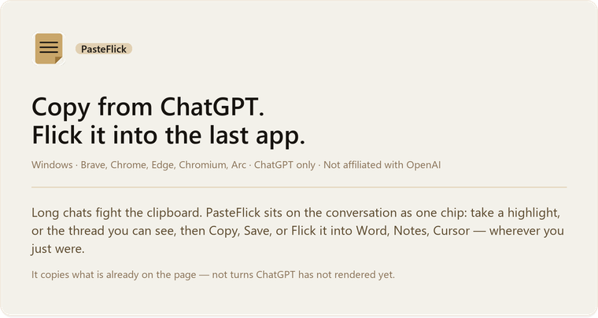
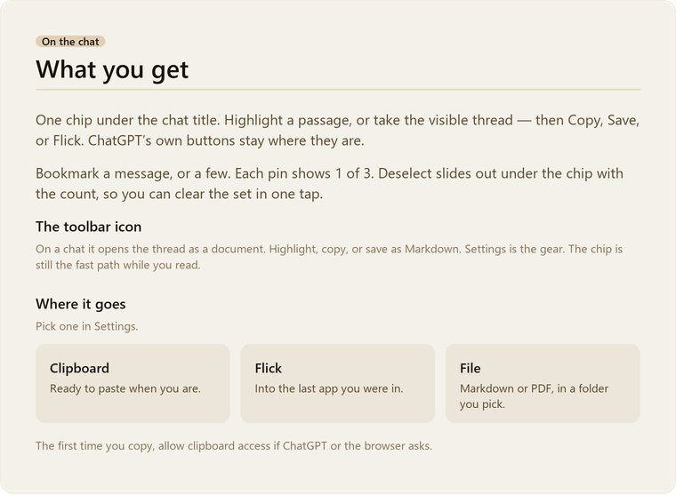
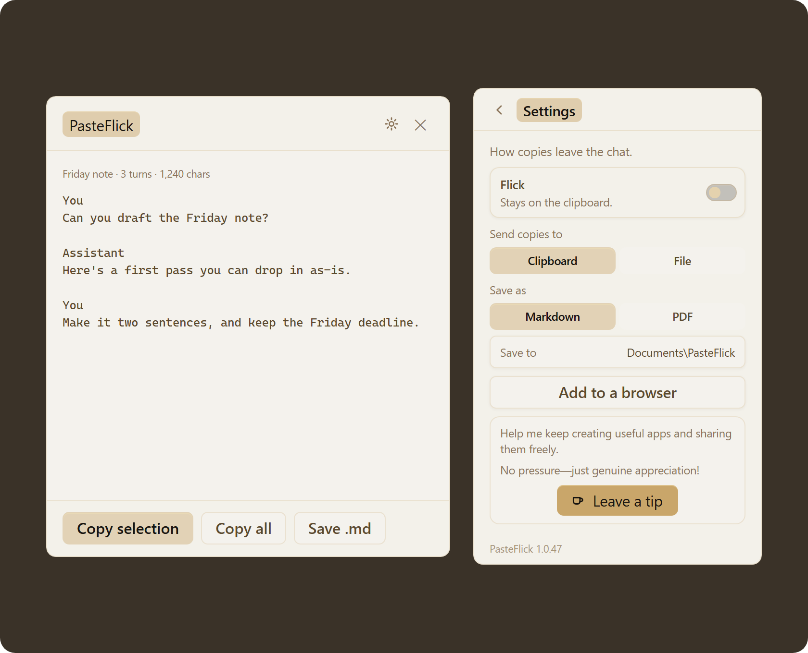
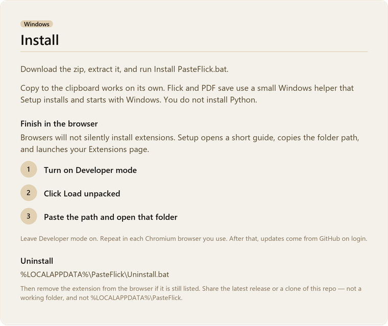
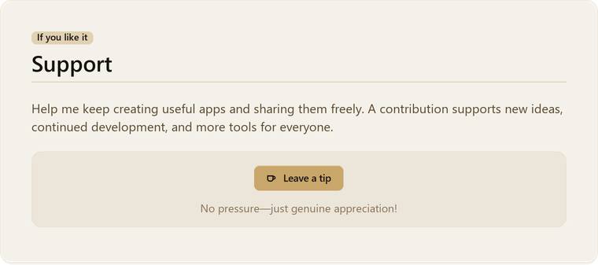
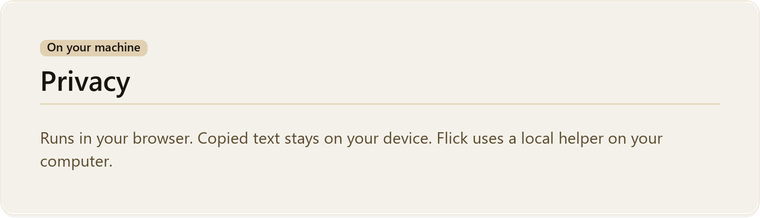

  

 

  

 

  

 

  

 

  

 

  

 

  

 

  

 

  

# PasteFlick

PasteFlick is a Windows browser extension for ChatGPT. Copy a highlight or the visible thread, then Flick it into the last app you were using — Word, Notes, Cursor, wherever you just were.

It copies what is already on the page, not turns ChatGPT has not rendered. One chip on the chat: Copy, Save, or Flick. Bookmark messages with pins. Works in Brave, Chrome, Edge, Chromium, and Arc. Not affiliated with OpenAI.

**Install.** Download the [Windows zip](https://github.com/HeadAroundIt/pasteflick/releases/latest), extract it, run `Install PasteFlick.bat`, then Load unpacked in the browser.

**Privacy.** Runs in your browser. Copied text stays on your device. Flick uses a local helper on your computer.

Repo: [github.com/HeadAroundIt/pasteflick](https://github.com/HeadAroundIt/pasteflick)
